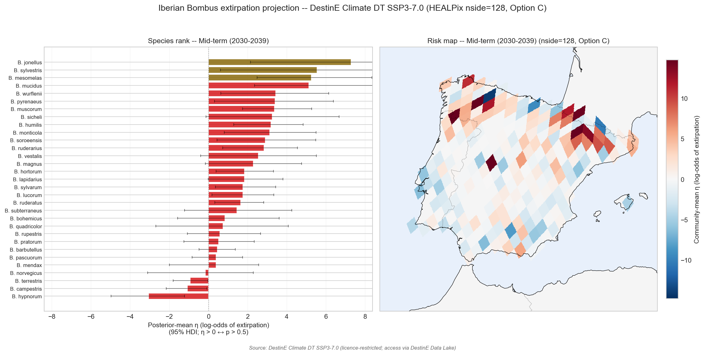

# weatherxbiodiversity-projection-nside128

> **Iberian *Bombus* extirpation projection at HEALPix nside=128 — full GLMM refit on the DestinE Climate DT substrate.**
> Methodological extension of [`weatherxbiodiversity-projection`](https://github.com/annefou/weatherxbiodiversity-projection) (HEALPix nside=64).
> Reference paper: [10.1126/science.aax8591](https://doi.org/10.1126/science.aax8591)

This repository fits Soroye et al.'s (2020) thermal-niche extirpation GLMM at **HEALPix nside=128 (~46 km)** — the native pixelisation of DestinE Climate DT IFS-NEMO standard — for Iberian *Bombus*, then projects to SSP3-7.0.

It is a sibling resolution-doubling extension of [`weatherxbiodiversity-projection`](https://github.com/annefou/weatherxbiodiversity-projection) (nside=64). The combined results across substrates feed the methodological diagnostic in [`weatherxbiodiversity-substrate-sensitivity`](https://github.com/annefou/weatherxbiodiversity-substrate-sensitivity).

## Headline result — Tier 1

![Tier-1 GLMM coefficient summary at HEALPix nside=128 — sc_TEI_delta = +0.347, 95% HDI [+0.139, +0.533], substrate-robust against the canonical CEA replication](figures/main_result_healpix.png)

The GLMM coefficient on `sc_TEI_delta` at HEALPix nside=128 is **+0.347, 95% HDI [+0.139, +0.533]** — within ±30% of the original CEA replication (+0.479) and the nside=64 replication (+0.454). **The TEI-based extirpation mechanism is substrate-robust.**

## Headline result — Tier 2



Tier-2 projects the substrate-matched GLMM forward to DestinE Climate DT SSP3-7.0 at the **same** native pixelisation it was fit on (no parent-aggregation deviation). Per-species rankings should be cross-checked against the substrate-sensitivity diagnostic (sibling repo).

## Why this repo exists

The canonical replication ([`weatherxbiodiversity-projection`](https://github.com/annefou/weatherxbiodiversity-projection)) fits the GLMM at HEALPix nside=64 and projects DestinE data aggregated to that grid. This sibling repo refits the **entire GLMM at nside=128**, the native DestinE substrate, so that:

- Tier 1 estimates the GLMM coefficients at three substrates (CEA, nside=64, nside=128) — the substrate-robustness check
- Tier 2 projects without any cross-substrate aggregation step
- The combined output supports the cross-substrate diagnostic in [`weatherxbiodiversity-substrate-sensitivity`](https://github.com/annefou/weatherxbiodiversity-substrate-sensitivity)

## Quick start

```bash
git clone https://github.com/annefou/weatherxbiodiversity-projection-nside128.git
cd weatherxbiodiversity-projection-nside128
mamba env create -f environment.yml
mamba activate weatherxbiodiversity-projection-nside128
snakemake --cores 1            # Tier 1 (HEALPix nside=128 GLMM refit)
snakemake --cores 1 tier2      # Tier 2 (DestinE) — needs DestinE credentials
```

## Pipeline structure

- **Tier 1 — HEALPix nside=128 GLMM refit** (notebooks 01, 02h–04h)
- **Tier 2 — DestinE Climate DT SSP3-7.0 projection** (notebooks 05–08)

## Citation

If you use this work, please cite:

- This software: [`CITATION.cff`](https://github.com/annefou/weatherxbiodiversity-projection-nside128/blob/main/CITATION.cff) → DOI [10.5281/zenodo.20113780](https://doi.org/10.5281/zenodo.20113780).
- The original paper: [10.1126/science.aax8591](https://doi.org/10.1126/science.aax8591).
- The canonical nside=64 sibling and the substrate-sensitivity diagnostic via their own DOIs (see CITATION.cff `references`).
